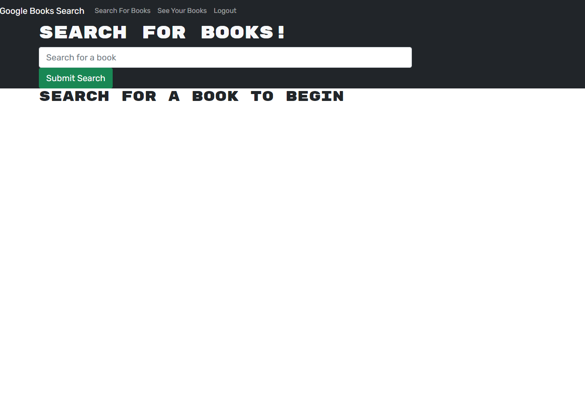

# Title

Search Book Engine

## Description

An application that utilizes GoogleSearch api to fetch books. Once log, user can save their book of choice into their profile. Navigate to 'see you books' youll be able to update and delete your saved books.

## Table of Contents

  - [Installation](#installation)
  - [Usage](#usage)
  - [Credits](#credits)
  - [License](#license)

## Installation

npm i, npm run develop

## Usage

## Deploy Link

https://searchbookwithgoogle.herokuapp.com/

## License

None

## Features

This app uses Google Search engine for pics and generate it into the premade columns. Allow user to save and delete books

## How to Contribute

If you created an application or package and would like other developers to contribute it, you can include guidelines for how to do so.The[Contributor Covenant](https://www.contributor-covenant.org/) is an industry standard, but you can always write your own if you'd prefer.

## Test

npm run tests

